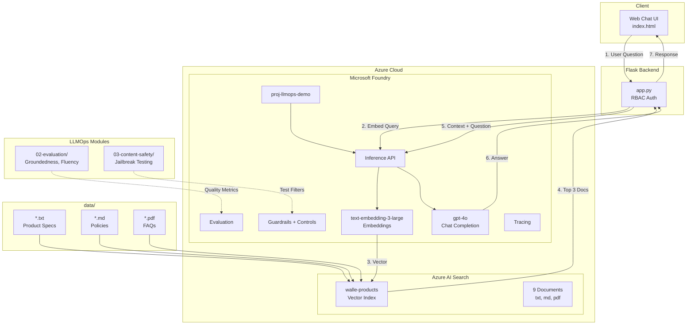
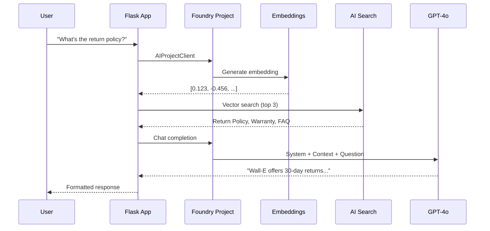
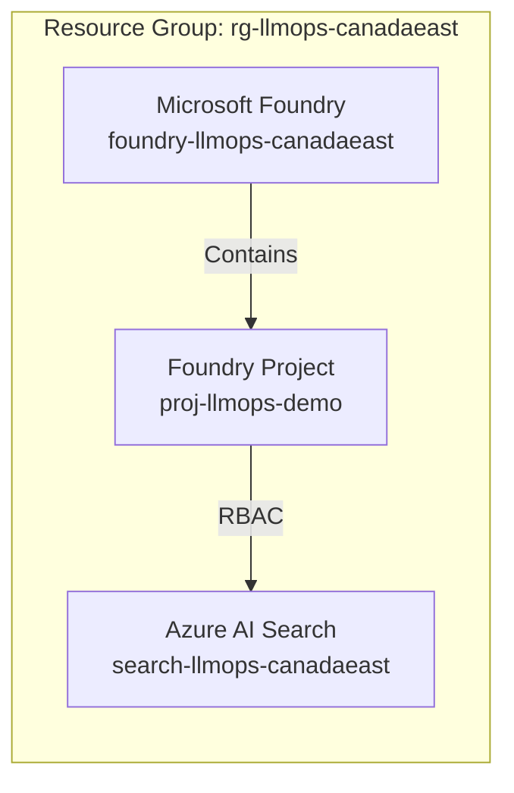

# LLMOps Workshop - Microsoft Foundry

[](https://ai.azure.com)
[](LICENSE)

**Operational LLMOps workshop** using **Microsoft Foundry** — focused on operationalizing an existing RAG chatbot, not building one from scratch. Covers automated evaluation workflows, model swap + versioning, CI/CD promotion gates (Azure DevOps), and MLflow GenAI integration.

> **Audience:** Teams that already have a RAG chatbot and need to understand how to operationalize it — the "Ops" in LLMOps.

## Architecture



## RAG Flow Diagram



## What You'll Learn

Operationalize a RAG chatbot ("Wall-E Electronics") deployed on Microsoft Foundry:

| Module | Topic | Key Concepts | Azure Services | Time |
|--------|-------|--------------|----------------|------|
| 1 | Orientation & Architecture | Pre-built RAG chatbot walkthrough | Microsoft Foundry, AI Search | 10 min |
| 2 | Automated Evaluation Workflows | Groundedness, relevance, similarity, fluency with pass/fail gates | Azure AI Evaluation SDK | 25 min |
| 3 | Model Swap + Re-Evaluation | Safely replace a model, auto-compare evaluations side-by-side | Foundry Model Catalog | 25 min |
| 4 | CI/CD with Promotion Gates | Azure DevOps pipeline with eval + safety gates blocking merges | Azure DevOps | 25 min |
| 5 | MLflow for GenAI Ops | Tracing, prompt versioning, mlflow.evaluate() | MLflow 2.18+ | 25 min |
| 6 | Q&A / Apply to Your System | Map patterns to your existing chatbot | — | 10 min |

**Total Duration:** ~120 minutes

### Skills You'll Gain

- Run automated quality evaluations (4 metrics) with promotion gates
- Safely swap models and compare quality before promoting
- Build CI/CD pipelines (Azure DevOps) with evaluation and content safety gates
- Use MLflow tracing, prompt versioning, and evaluate() alongside Foundry
- Content safety testing with jailbreak detection

## Authentication

This workshop uses **RBAC (Role-Based Access Control)** — **no API keys required**.

Your Azure CLI credentials are used automatically via `DefaultAzureCredential`:
- `Cognitive Services OpenAI User` — Call Foundry inference APIs
- `Search Index Data Contributor` — Read/write search indices
- `Search Service Contributor` — Manage search service

## Prerequisites

- Azure subscription with Contributor access
- [Azure CLI](https://docs.microsoft.com/cli/azure/install-azure-cli) v2.50+
- [Python 3.10+](https://www.python.org/downloads/)
- [VS Code](https://code.visualstudio.com/) with Python extension

## Quick Start

### 1. Clone and Setup

```powershell
# Clone the repository
git clone https://github.com/ritwickmicrosoft/llmops-workshop-demo.git
cd llmops-workshop-demo

# Create Python virtual environment
python -m venv .venv
.\.venv\Scripts\Activate.ps1
pip install -r requirements.txt

# Login to Azure
az login
```

### 2. Deploy Microsoft Foundry (via Portal)

1. Go to [Microsoft Foundry Portal](https://ai.azure.com)
2. Create a new project (e.g., `proj-llmops-demo`)
3. Deploy models from Model Catalog:
   - `gpt-4o` for chat completions
   - `text-embedding-3-large` for embeddings
4. Note your Foundry endpoint: `https://<your-resource>.services.ai.azure.com`

### 3. Deploy Azure AI Search

```powershell
# Set variables
$env:AZURE_RESOURCE_GROUP = "rg-llmops-canadaeast"
$env:AZURE_LOCATION = "canadaeast"

# Create resource group
az group create --name $env:AZURE_RESOURCE_GROUP --location $env:AZURE_LOCATION

# Create Azure AI Search
az search service create `
  --name "search-llmops-canadaeast" `
  --resource-group $env:AZURE_RESOURCE_GROUP `
  --location $env:AZURE_LOCATION `
  --sku Basic

# Assign RBAC roles (replace with your Foundry resource)
$myId = (az ad signed-in-user show --query id -o tsv)
az role assignment create --assignee $myId --role "Search Index Data Contributor" `
  --scope $(az search service show --name search-llmops-canadaeast --resource-group $env:AZURE_RESOURCE_GROUP --query id -o tsv)
```

### 3. Create Vector Index

```powershell
# Update .env with your resource endpoints
Copy-Item .env.example .env
# Edit .env with your endpoints

# Create search index with sample documents
cd 01-rag-chatbot
python create_search_index.py
```

### 4. Run Chatbot

```powershell
cd ../04-frontend
python app.py
# Open http://localhost:5000
```

### 5. Open Workshop Playbook

Open [`LLMOps_Workshop_Playbook.html`](https://htmlpreview.github.io/?https://github.com/ritwickmicrosoft/llmops-workshop-demo/blob/main/LLMOps_Workshop_Playbook.html) in your browser for detailed step-by-step instructions.

## 📁 Project Structure

```
llmops-workshop/
├── data/                           # Sample documents (txt, md, pdf)
│   ├── laptop-pro-15.txt           # Product specs
│   ├── smartwatch-x200.txt         # Product specs
│   ├── nc500-headphones.txt        # Product specs
│   ├── tablet-s10.txt              # Product specs
│   ├── return-policy.md            # Policy document
│   ├── warranty-policy.md          # Policy document
│   ├── shipping-policy.md          # Policy document
│   ├── troubleshooting-guide.md    # Support document
│   └── faq.pdf                     # PDF document
├── 01-rag-chatbot/                 # RAG Chatbot (pre-built, orientation only)
│   └── create_search_index.py      # Reads data/ folder, vectorizes, indexes
├── 02-evaluation/                  # ★ Automated Evaluation Workflows
│   ├── eval_dataset.jsonl          # Test dataset (Q&A pairs)
│   ├── run_evaluation.py           # Basic evaluation (groundedness + fluency)
│   ├── run_evaluation_enhanced.py  # Enhanced: 4 metrics + promotion gates
│   └── eval_results/               # Generated reports (HTML + JSON)
├── 03-content-safety/              # Content Safety Module
│   ├── content_filter_config.json  # Filter configuration
│   ├── test_content_safety.py      # Test content filters
│   └── test_results/               # Generated reports (HTML + JSON)
├── 04-frontend/                    # Web Chat Interface
│   ├── app.py                      # Flask backend (RBAC + Tracing)
│   ├── index.html                  # Dark-themed chat UI
│   └── requirements.txt            # Frontend dependencies
├── 05-model-swap/                  # ★ Model Swap + Re-Evaluation
│   ├── model_swap_eval.py          # Compare models side-by-side
│   └── comparison_results/         # Generated comparison reports
├── 06-cicd/                        # ★ CI/CD with Promotion Gates
│   ├── azure-pipelines.yml         # Azure DevOps pipeline (4 stages)
│   ├── promotion_gate.py           # Gate checker (eval, safety, comparison)
│   └── README.txt                  # Setup instructions
├── 07-mlflow/                      # ★ MLflow GenAI Integration
│   ├── mlflow_tracing_demo.py      # Tracing + prompt versioning
│   ├── mlflow_eval_demo.py         # mlflow.evaluate() vs Azure AI Eval
│   └── mlflow_eval_results/        # Generated results
├── infra/                          # Infrastructure as Code
│   ├── main.bicep                  # Main Bicep template
│   └── modules/core.bicep          # Core resources
├── .env.example                    # Environment template
├── requirements.txt                # Python dependencies
├── LLMOps_Workshop_Playbook.html   # Interactive step-by-step guide
└── README.md                       # This file
```

## Azure Resources



| Resource | Name | Purpose |
|----------|------|---------|
| Microsoft Foundry | `foundry-llmops-canadaeast` | Unified AI platform with inference API |
| Foundry Project | `proj-llmops-demo` | Models: gpt-4o, text-embedding-3-large |
| Azure AI Search | `search-llmops-canadaeast` | Vector store for RAG |

## Sample Documents

The `data/` folder contains 9 Wall-E Electronics documents in multiple formats:

| Format | Files | Description |
|--------|-------|-------------|
| `.txt` | 4 files | Product specifications (Laptop, Watch, Headphones, Tablet) |
| `.md` | 4 files | Policies & support (Returns, Warranty, Shipping, Troubleshooting) |
| `.pdf` | 1 file | FAQ document |

The `create_search_index.py` script automatically:
1. Reads all files from `data/` folder
2. Extracts text from .txt, .md, and .pdf files
3. Generates vector embeddings using Microsoft Foundry inference API
4. Uploads to Azure AI Search with semantic and vector search

## 📊 Evaluation Metrics

The enhanced evaluation script (`02-evaluation/run_evaluation_enhanced.py`) tests RAG quality using 4 metrics with pass/fail promotion gates:

### Metrics (1-5 Scale)

| Metric | Description | Default Gate |
|--------|-------------|-------------|
| **Groundedness** | Is the response supported by the retrieved context? | ≥4.0 |
| **Relevance** | Does the response address the user's question? | ≥4.0 |
| **Similarity** | How close is the response to the expected answer? | ≥3.5 |
| **Fluency** | Is the response grammatically correct and natural? | ≥4.0 |

### Scoring Standards

| Score | Rating | Action |
|-------|--------|--------|
| **4.0-5.0** | ✓ Excellent | Production-ready |
| **3.0-4.0** | ~ Good | Minor improvements needed |
| **2.0-3.0** | ⚠ Needs Work | Improve prompts or retrieval |
| **1.0-2.0** | ✗ Poor | Major rework required |

### Sample Results

```
============================================================
  Evaluation Results
============================================================
  Aggregate Metrics:
  ----------------------------------------
  ✗ Groundedness    2.60/5.0
  ~ Fluency         3.00/5.0

  📊 Recommendations:
  - Consider improving groundedness: current score 2.60
  - Consider improving fluency: current score 3.00
```

> **Note:** Low groundedness scores in demo are expected because the `context` field in `eval_dataset.jsonl` only contains document titles, not full text. In production with actual RAG retrieval, scores improve significantly.

### Run Evaluation

```powershell
# Basic evaluation (2 metrics)
python 02-evaluation/run_evaluation.py

# Enhanced evaluation with promotion gates (4 metrics)
python 02-evaluation/run_evaluation_enhanced.py

# CI mode (exit code 1 if gate fails — for pipelines)
python 02-evaluation/run_evaluation_enhanced.py --ci

# Custom thresholds
python 02-evaluation/run_evaluation_enhanced.py --threshold 3.5

# Evaluate a specific model
python 02-evaluation/run_evaluation_enhanced.py --model gpt-4o-mini --ci
```

## Model Swap & Re-Evaluation

### Why Model Swap?

In production LLM applications, you frequently need to change models:

| Trigger | Example |
|---------|--------|
| **Cost optimization** | gpt-4o → gpt-4o-mini (~15x cheaper per token) while maintaining quality |
| **Latency** | Smaller models respond faster for real-time customer support |
| **New model version** | Azure ships gpt-4o `2024-11-20` with improved reasoning — validate before adopting |
| **Model deprecation** | Azure retires older model versions on published dates, forcing migration |
| **Capacity/availability** | Quota limits or regional availability require switching model families |

> **Risk:** Swapping blindly can degrade answer quality — customers notice before your team does. This workflow prevents that by auto-evaluating both models on the same test set and rejecting if quality drops.

### How It Works

The model swap script (`05-model-swap/model_swap_eval.py`) safely compares two models before swapping:

1. Evaluates the **current** model (baseline)
2. Evaluates the **candidate** model
3. Compares side-by-side with regression detection
4. Produces a recommendation: swap or don't swap

```powershell
# Default: compare gpt-4o vs gpt-4o-mini
python 05-model-swap/model_swap_eval.py

# Custom models
python 05-model-swap/model_swap_eval.py --current gpt-4o --candidate gpt-4o-mini

# CI mode (exit code 1 if swap not recommended)
python 05-model-swap/model_swap_eval.py --ci
```

## CI/CD Pipeline (Azure DevOps)

The pipeline (`06-cicd/azure-pipelines.yml`) implements promotion gates:

```
┌─────────────────┐    ┌──────────────────┐    ┌────────────────┐    ┌──────────┐
│ EvaluationGate  │───>│ ContentSafetyGate│───>│ ModelSwapGate  │───>│  Deploy  │
│ 4 metrics ≥ 4.0 │    │ Pass rate ≥ 90%  │    │ No regression  │    │ (main)   │
└─────────────────┘    └──────────────────┘    └────────────────┘    └──────────┘
       FAIL → Block PR        FAIL → Block PR      (optional)       After all pass
```

### Pipeline Stages

| Stage | Trigger | Gate Logic |
|-------|---------|------------|
| **EvaluationGate** | Every PR | All 4 metrics must meet thresholds |
| **ContentSafetyGate** | Every PR | ≥90% content safety test pass rate |
| **ModelSwapGate** | `[model-swap]` in commit msg | Candidate meets thresholds + no regression |
| **Deploy** | Main branch only | After all gates pass |

### Setup in Azure DevOps

1. Create a **Service Connection** named `llmops-service-connection`
2. Grant the service principal: `Cognitive Services OpenAI User` on `foundry-llmops-canadaeast`
3. Create a pipeline pointing to `06-cicd/azure-pipelines.yml`

```powershell
# Test gate logic locally
python 06-cicd/promotion_gate.py --check-eval --results-dir 02-evaluation/eval_results
python 06-cicd/promotion_gate.py --check-content-safety --results-dir 03-content-safety/test_results
```

## MLflow GenAI Integration

The MLflow modules (`07-mlflow/`) show how MLflow's newer GenAI features complement Foundry:

### Tracing Demo (`mlflow_tracing_demo.py`)

- **Auto-tracing**: `mlflow.openai.autolog()` captures all LLM calls
- **Custom spans**: RAG pipeline traced as `[Retrieval] → [Generation]`
- **Prompt versioning**: System prompts logged as versioned artifacts
- **App versioning**: Full RAG config (model + prompt + retrieval params) logged

### Evaluation Demo (`mlflow_eval_demo.py`)

- **mlflow.evaluate()**: Built-in QA metrics (accuracy, ROUGE, etc.)
- **Custom evaluators**: Domain-specific checks (length, citations, hallucination phrases)
- **Comparison**: When to use Azure AI Evaluation vs MLflow evaluate()

```powershell
# Run tracing demo
python 07-mlflow/mlflow_tracing_demo.py

# Run evaluation demo
python 07-mlflow/mlflow_eval_demo.py

# View results in MLflow UI
mlflow ui --port 5001
# Open http://localhost:5001
```

### When to Use Which

| Scenario | Tool |
|----------|------|
| Development iteration (prompt tweaks, A/B testing) | **MLflow** |
| Production quality gates (CI/CD pipeline) | **Azure AI Evaluation** |
| Production monitoring | **Foundry Tracing** (App Insights) |
| Experiment tracking + comparison | **MLflow** |
| Compliance reporting | **Azure AI Evaluation** → Foundry Portal |

## Content Safety Testing

The content safety script (`03-content-safety/test_content_safety.py`) tests protection against harmful content and prompt injection using Microsoft Foundry.

### Foundry Content Safety (via Guardrails + Controls)

| Category | Default Behavior | Description |
|----------|------------------|-------------|
| **Hate Speech** | Filtered | Blocked automatically |
| **Sexual Content** | Filtered | Blocked automatically |
| **Violence** | Filtered | Blocked automatically |
| **Self-Harm** | Filtered | Blocked automatically |
| **Jailbreak/Prompt Injection** | Configurable | Enable via Guardrails + Controls |

### Test Categories

| Category | Tests | Description |
|----------|-------|-------------|
| `baseline` | 2 | Normal product queries |
| `prompt_injection` | 3 | Jailbreak attempts (DAN, role-play) |
| `boundary` | 3 | Off-topic, competitor, PII requests |

### Sample Results

```
============================================================
  Content Safety Testing Complete!
============================================================
  Total Tests: 8
  Passed: 8
  Failed: 0
  Pass Rate: 100.0%

  Filter Blocked: 0
  Model Refused: 8 (handled via system prompt)
```

> **Note:** Jailbreak attempts are handled by the **system prompt**, not default content filters. The model correctly refuses malicious requests. For production, configure **Guardrails + Controls** in Foundry portal.

### Run Content Safety Tests

```powershell
python 03-content-safety/test_content_safety.py
```

Generates HTML report in `03-content-safety/test_results/`.

## Cleanup

Delete all resources when done:

```powershell
az group delete --name rg-llmops-demo --yes --no-wait
```

## Resources

- [Microsoft Foundry Documentation](https://learn.microsoft.com/azure/ai-studio/)
- [Azure AI Inference SDK](https://learn.microsoft.com/azure/ai-studio/how-to/develop/sdk-overview)
- [Azure AI Search Vector Search](https://learn.microsoft.com/azure/search/vector-search-overview)

## License

MIT License

---

**LLMOps Workshop — Microsoft Foundry — February 2026**
