# LLMOps Workshop - Azure AI Foundry

[](https://ai.azure.com)
[](LICENSE)

End-to-end LLMOps workshop using Azure AI Foundry to build a RAG-enabled chatbot with vector search and RBAC authentication.

## �️ Architecture

```mermaid
flowchart TB
    subgraph Client["🖥️ Client"]
        UI["Web Chat UI<br/>index.html"]
    end

    subgraph Backend["⚙️ Flask Backend"]
        APP["app.py<br/>RBAC Auth"]
    end

    subgraph Azure["☁️ Azure Cloud"]
        subgraph AIFoundry["Azure AI Foundry"]
            FOUNDRY["foundry-llmops-demo<br/>(AIServices)"]
            PROJECT["proj-llmops-demo"]
        end
        
        subgraph OpenAI["Azure OpenAI"]
            GPT["gpt-4o<br/>Chat Completion"]
            EMB["text-embedding-3-large<br/>Embeddings"]
            FILTER["Content Filters<br/>Hate/Sexual/Violence"]
        end
        
        subgraph Search["Azure AI Search"]
            INDEX["walle-products<br/>Vector Index"]
            DOCS["9 Documents<br/>txt, md, pdf"]
        end
    end

    subgraph LLMOps["📊 LLMOps Modules"]
        EVAL["02-evaluation/<br/>Groundedness, Fluency"]
        SAFETY["03-content-safety/<br/>Jailbreak Testing"]
    end

    subgraph DataFolder["📁 data/"]
        TXT["*.txt<br/>Product Specs"]
        MD["*.md<br/>Policies"]
        PDF["*.pdf<br/>FAQs"]
    end

    UI -->|"1. User Question"| APP
    APP -->|"2. Embed Query"| EMB
    EMB -->|"3. Vector"| INDEX
    INDEX -->|"4. Top 3 Docs"| APP
    APP -->|"5. Context + Question"| GPT
    GPT -->|"6. Answer"| APP
    APP -->|"7. Response"| UI
    
    TXT --> INDEX
    MD --> INDEX
    PDF --> INDEX
    
    FOUNDRY -.->|"Connection"| OpenAI
    FOUNDRY -.->|"Connection"| Search
    
    EVAL -.->|"Quality Metrics"| GPT
    SAFETY -.->|"Test Filters"| FILTER
```



## 🔄 RAG Flow Diagram

```mermaid
sequenceDiagram
    participant U as 👤 User
    participant F as 🌐 Flask App
    participant E as 🧠 Embeddings
    participant S as 🔍 AI Search
    participant G as 💬 GPT-4o

    U->>F: "What's the return policy?"
    F->>E: Generate embedding
    E-->>F: [0.123, -0.456, ...]
    F->>S: Vector search (top 3)
    S-->>F: Return Policy, Warranty, FAQ
    F->>G: System + Context + Question
    G-->>F: "Wall-E offers 30-day returns..."
    F-->>U: Formatted response
```



## 🎯 What You'll Learn

Build a complete RAG (Retrieval-Augmented Generation) chatbot for "Wall-E Electronics":

| Module | Topic | Key Concepts | Azure Services | Difficulty |
|--------|-------|--------------|----------------|------------|
| 1 | Environment Setup | SDK auth, RBAC, workspace config | Azure CLI, DefaultAzureCredential | Beginner |
| 2 | Deploy Azure Infrastructure | IaC, resource provisioning | AI Foundry, OpenAI, AI Search | Beginner |
| 3 | Create Vector Index | Embeddings, vector search, chunking | Azure OpenAI, AI Search | Intermediate |
| 4 | Run RAG Chatbot | Retrieval, prompt engineering, context | Flask, GPT-4o, Vector Store | Intermediate |
| 5 | Test & Explore | Query testing, response quality | Web UI, Azure Portal | Beginner |
| 6 | Run Evaluation | Groundedness, fluency metrics | Azure AI Evaluation SDK | Intermediate |
| 7 | Content Safety | Jailbreak testing, content filters | Azure OpenAI Content Filters | Intermediate |

**Total Duration:** ~120 minutes

### 🧠 Skills You'll Gain

- ✅ Deploy Azure AI resources with RBAC (no API keys)
- ✅ Create vector embeddings from documents (txt, md, pdf)
- ✅ Build a semantic search index with Azure AI Search
- ✅ Implement RAG pattern with GPT-4o
- ✅ Build a production-ready chat interface
- ✅ Evaluate RAG quality with groundedness & fluency metrics
- ✅ Test content safety and prompt injection protection

## 🔐 Authentication

This workshop uses **RBAC (Role-Based Access Control)** — **no API keys required**.

Your Azure CLI credentials are used automatically via `DefaultAzureCredential`:
- `Cognitive Services OpenAI User` — Call Azure OpenAI APIs
- `Search Index Data Contributor` — Read/write search indices
- `Search Service Contributor` — Manage search service

## 📋 Prerequisites

- Azure subscription with Contributor access
- [Azure CLI](https://docs.microsoft.com/cli/azure/install-azure-cli) v2.50+
- [Python 3.10+](https://www.python.org/downloads/)
- [VS Code](https://code.visualstudio.com/) with Python extension

## 🚀 Quick Start

### 1. Clone and Setup

```powershell
# Clone the repository
git clone https://github.com/ritwickmicrosoft/llmops-workshop-demo.git
cd llmops-workshop-demo

# Create Python virtual environment
python -m venv .venv
.\.venv\Scripts\Activate.ps1
pip install -r requirements.txt

# Login to Azure
az login
```

### 2. Deploy Azure Resources

```powershell
# Set variables
$env:AZURE_RESOURCE_GROUP = "rg-llmops-demo"
$env:AZURE_LOCATION = "eastus"

# Create resource group
az group create --name $env:AZURE_RESOURCE_GROUP --location $env:AZURE_LOCATION

# Create Azure OpenAI
az cognitiveservices account create `
  --name "aoai-llmops-demo" `
  --resource-group $env:AZURE_RESOURCE_GROUP `
  --location $env:AZURE_LOCATION `
  --kind OpenAI `
  --sku S0 `
  --custom-domain "aoai-llmops-demo"

# Deploy models
az cognitiveservices account deployment create `
  --name "aoai-llmops-demo" `
  --resource-group $env:AZURE_RESOURCE_GROUP `
  --deployment-name "gpt-4o" `
  --model-name "gpt-4o" `
  --model-version "2024-11-20" `
  --model-format OpenAI `
  --sku-capacity 10 `
  --sku-name Standard

az cognitiveservices account deployment create `
  --name "aoai-llmops-demo" `
  --resource-group $env:AZURE_RESOURCE_GROUP `
  --deployment-name "text-embedding-3-large" `
  --model-name "text-embedding-3-large" `
  --model-version "1" `
  --model-format OpenAI `
  --sku-capacity 10 `
  --sku-name Standard

# Create Azure AI Search
az search service create `
  --name "search-llmops-demo" `
  --resource-group $env:AZURE_RESOURCE_GROUP `
  --location $env:AZURE_LOCATION `
  --sku Basic

# Assign RBAC roles (wait 2-3 min after for propagation)
$myId = (az ad signed-in-user show --query id -o tsv)
az role assignment create --assignee $myId --role "Cognitive Services OpenAI User" `
  --scope $(az cognitiveservices account show --name aoai-llmops-demo --resource-group $env:AZURE_RESOURCE_GROUP --query id -o tsv)
az role assignment create --assignee $myId --role "Search Index Data Contributor" `
  --scope $(az search service show --name search-llmops-demo --resource-group $env:AZURE_RESOURCE_GROUP --query id -o tsv)
```

### 3. Create Vector Index

```powershell
# Update .env with your resource endpoints
Copy-Item .env.example .env
# Edit .env with your endpoints

# Create search index with sample documents
cd 01-rag-chatbot
python create_search_index.py
```

### 4. Run Chatbot

```powershell
cd ../04-frontend
python app.py
# Open http://localhost:5000
```

### 5. Open Workshop Playbook

Open [`LLMOps_Workshop_Playbook.html`](https://htmlpreview.github.io/?https://github.com/ritwickmicrosoft/llmops-workshop-demo/blob/main/LLMOps_Workshop_Playbook.html) in your browser for detailed step-by-step instructions.

## 📁 Project Structure

```
llmops-workshop/
├── data/                           # Sample documents (txt, md, pdf)
│   ├── laptop-pro-15.txt           # Product specs
│   ├── smartwatch-x200.txt         # Product specs
│   ├── nc500-headphones.txt        # Product specs
│   ├── tablet-s10.txt              # Product specs
│   ├── return-policy.md            # Policy document
│   ├── warranty-policy.md          # Policy document
│   ├── shipping-policy.md          # Policy document
│   ├── troubleshooting-guide.md    # Support document
│   └── faq.pdf                     # PDF document
├── 01-rag-chatbot/                 # RAG Chatbot Module
│   └── create_search_index.py      # Reads data/ folder, vectorizes, indexes
├── 02-evaluation/                  # Evaluation Module
│   ├── eval_dataset.jsonl          # Test dataset (Q&A pairs)
│   ├── run_evaluation.py           # Run quality evaluation
│   └── eval_results/               # Generated reports (HTML + JSON)
├── 03-content-safety/              # Content Safety Module
│   ├── content_filter_config.json  # Filter configuration
│   ├── test_content_safety.py      # Test content filters
│   └── test_results/               # Generated reports (HTML + JSON)
├── 04-frontend/                    # Web Chat Interface
│   ├── app.py                      # Flask backend (RBAC)
│   ├── index.html                  # Dark-themed chat UI
│   └── requirements.txt            # Frontend dependencies
├── infra/                          # Infrastructure as Code
│   ├── main.bicep                  # Main Bicep template
│   └── modules/core.bicep          # Core resources
├── .env.example                    # Environment template
├── requirements.txt                # Python dependencies
├── LLMOps_Workshop_Playbook.html   # Interactive step-by-step guide
└── README.md                       # This file
```

## 🛠️ Azure Resources

```mermaid
graph LR
    subgraph RG["Resource Group: rg-llmops-demo"]
        A["🤖 Azure AI Foundry<br/>foundry-llmops-demo"]
        B["🧠 Azure OpenAI<br/>aoai-llmops-eastus"]
        C["🔍 Azure AI Search<br/>search-llmops-dev-*"]
    end
    
    A -->|"RBAC"| B
    A -->|"RBAC"| C
```



| Resource | Name | Purpose |
|----------|------|---------|
| Azure AI Foundry | `foundry-llmops-demo` | Unified AI platform (AIServices) |
| Azure OpenAI | `aoai-llmops-eastus` | LLM (gpt-4o) + embeddings |
| Azure AI Search | `search-llmops-dev-*` | Vector store for RAG |

## 📄 Sample Documents

The `data/` folder contains 9 Wall-E Electronics documents in multiple formats:

| Format | Files | Description |
|--------|-------|-------------|
| `.txt` | 4 files | Product specifications (Laptop, Watch, Headphones, Tablet) |
| `.md` | 4 files | Policies & support (Returns, Warranty, Shipping, Troubleshooting) |
| `.pdf` | 1 file | FAQ document |

The `create_search_index.py` script automatically:
1. Reads all files from `data/` folder
2. Extracts text from .txt, .md, and .pdf files
3. Generates vector embeddings using Azure OpenAI
4. Uploads to Azure AI Search with semantic and vector search

## 📊 Evaluation Metrics

The evaluation script (`02-evaluation/run_evaluation.py`) tests RAG quality using Azure AI Evaluation SDK:

### Metrics (1-5 Scale)

| Metric | Description | Target |
|--------|-------------|--------|
| **Groundedness** | Is the response supported by the retrieved context? | ≥4.0 |
| **Fluency** | Is the response grammatically correct and natural? | ≥4.0 |

### Scoring Standards

| Score | Rating | Action |
|-------|--------|--------|
| **4.0-5.0** | ✓ Excellent | Production-ready |
| **3.0-4.0** | ~ Good | Minor improvements needed |
| **2.0-3.0** | ⚠ Needs Work | Improve prompts or retrieval |
| **1.0-2.0** | ✗ Poor | Major rework required |

### Sample Results

```
============================================================
  Evaluation Results
============================================================
  Aggregate Metrics:
  ----------------------------------------
  ✗ Groundedness    2.60/5.0
  ~ Fluency         3.00/5.0

  📊 Recommendations:
  - Consider improving groundedness: current score 2.60
  - Consider improving fluency: current score 3.00
```

> **Note:** Low groundedness scores in demo are expected because the `context` field in `eval_dataset.jsonl` only contains document titles, not full text. In production with actual RAG retrieval, scores improve significantly.

### Run Evaluation

```powershell
$env:AZURE_OPENAI_ENDPOINT = "https://aoai-llmops-eastus.openai.azure.com/"
python 02-evaluation/run_evaluation.py
```

## 🛡️ Content Safety Testing

The content safety script (`03-content-safety/test_content_safety.py`) tests protection against harmful content and prompt injection.

### Azure OpenAI Default Filters

| Category | Default Severity | Description |
|----------|------------------|-------------|
| **Hate Speech** | Medium | Blocked automatically |
| **Sexual Content** | Medium | Blocked automatically |
| **Violence** | Medium | Blocked automatically |
| **Self-Harm** | Medium | Blocked automatically |
| **Jailbreak/Prompt Injection** | Not enabled | Requires custom filter config |

### Test Categories

| Category | Tests | Description |
|----------|-------|-------------|
| `baseline` | 2 | Normal product queries |
| `prompt_injection` | 3 | Jailbreak attempts (DAN, role-play) |
| `boundary` | 3 | Off-topic, competitor, PII requests |

### Sample Results

```
============================================================
  Content Safety Testing Complete!
============================================================
  Total Tests: 8
  ✓ Passed: 8
  ✗ Failed: 0
  Pass Rate: 100.0%

  Filter Blocked: 0
  Model Refused: 8 (handled via system prompt)
```

> **Note:** Jailbreak attempts are handled by the **system prompt**, not default content filters. The model correctly refuses malicious requests. For production, consider enabling **Prompt Shields** for additional protection.

### Run Content Safety Tests

```powershell
python 03-content-safety/test_content_safety.py
```

Generates HTML report in `03-content-safety/test_results/`.

## 🧹 Cleanup

Delete all resources when done:

```powershell
az group delete --name rg-llmops-demo --yes --no-wait
```

## 📚 Resources

- [Azure AI Foundry Documentation](https://learn.microsoft.com/azure/ai-studio/)
- [Azure OpenAI Service](https://learn.microsoft.com/azure/ai-services/openai/)
- [Azure AI Search Vector Search](https://learn.microsoft.com/azure/search/vector-search-overview)

## 📄 License

MIT License

---

**LLMOps Workshop — February 2026**
